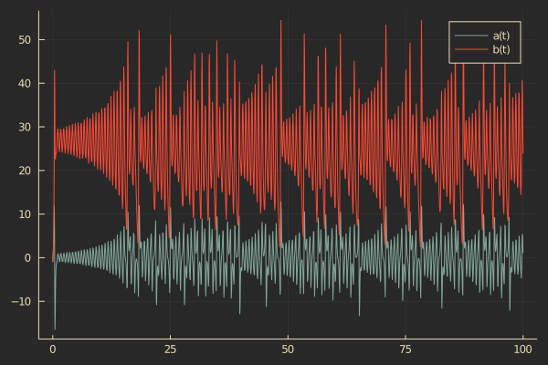

# SimulationLogs.jl


| **Documentation**                                                               | **Build Status**                                                                                |
|:-------------------------------------------------------------------------------:|:-----------------------------------------------------------------------------------------------:|
| [![][docs-dev-img]][docs-dev-url] | [![][github-img]][github-url] [![][codecov-img]][codecov-url] |


[docs-dev-img]: https://img.shields.io/badge/docs-latest-blue.svg
[docs-dev-url]: https://jonniedie.github.io/SimulationLogs.jl/dev

[docs-stable-img]: https://img.shields.io/badge/docs-stable-blue.svg
[docs-stable-url]: https://jonniedie.github.io/SimulationLogs.jl/stable

[github-img]: https://img.shields.io/github/workflow/status/jonniedie/SimulationLogs.jl/CI
[github-url]: https://github.com/jonniedie/SimulationLogs.jl/actions/workflows/CI

[codecov-img]: https://img.shields.io/codecov/c/github/jonniedie/SimulationLogs.jl
[codecov-url]: https://codecov.io/gh/jonniedie/SimulationLogs.jl

SimulationLogs lets you log variables from within a DifferentialEquations.jl ODE simulation.

## The Basics

To log a variable, use the `@log` macro before an existing variable declaration in the simulation. The syntax for this looks like:
```julia
@log x = u[1]+u[3]
```

To log an expression to an output variable without creating that variable in the simulation use the following syntax:
```julia
@log x u[1]+u[3]
```

To extract logged values from a simulation, use the `get_log` function. 
## Example

```julia
using DifferentialEquations
using SimulationLogs

function lorenz!(du, u, p, t)
    @log a = u[2]-u[1]
    @log b u[3]+a
    du[1] = p[1]*a
    du[2] = u[1]*(p[2]-u[3]) - u[2]
    du[3] = u[1]*u[2] - p[3]*u[3]
end

p = [10.0, 28.0, 8/3]
u0 = [1.0, 0.0, 0.0]
tspan = (0.0, 100.0)

prob = ODEProblem(lorenz!, u0, tspan, p)
sol = solve(prob)
```

Now we can extract the simulation log with `get_log`.

```julia
julia> out = get_log(sol)
SimulationLog with signals:
  a :: Float64
  b :: Float64

julia> out.a
1278-element Vector{Float64}:
 -1.0
 -0.9986446507807255
 -0.9851391500213387
 -0.8795890363074045
  ⋮
  5.072093963230147
  5.402915814211024
  2.8508213179241197
  1.1035303908083802

julia> out.b
1278-element Vector{Float64}:
 -1.0
 -0.9986446329663776
 -0.9851370030659728
 -0.8794452356321748
  ⋮
 40.76318830048574
 37.12952959918623
 29.24474520341088
 23.899870630658324
```

We can also use `scope` to visually inspect signals from the simulation. This requires using the Plots.jl library. For an interactive scope (pan, zoom, etc.), use the PlotlyJS backend of Plots by calling `plotlyjs()`.

```julia
using Plots; plotlyjs()

scope(sol, [:a, :b])
```


## FAQs
### How does this work with time stepping and variable caches and all that?
Despite the name, `@log` doesn't actually log anything while the simulation is running. The "logging" actually happens by calculating values from the stored solutions when `get_log` is called.

### Wait, how does that work?
There is a global `SimulationLog` that is turned off by default. When it is off, the `@log` macro basically doesn't do anything. The `get_log` function turns on the global log and then calls your simulation function (derivative function, vector field... whatever you want to call it) for each time point (these can be supplied, but will default to the saved time points). A copy of the global simulation log is passed as an output to the user, after which the global log then gets erased and turned back off.
### Will logging variables slow my simulation down?
Nope. There is no runtime overhead because no logging is actually happening during the simulation.

### How does this work when the same `@log` gets called multiple times in the same time step (e.g. in a subfunction that gets called more than once)?
It doesn't. Don't do that. There are some good ways we could handle this, but they aren't implemented right now.

### What if my parameters are changed during the simulation or my simulation depends on some changing global state?
Then this probably won't work. 


## Attributions
<div>Icons made by <a href="https://www.freepik.com" title="Freepik">Freepik</a> from <a href="https://www.flaticon.com/" title="Flaticon">www.flaticon.com</a></div>
