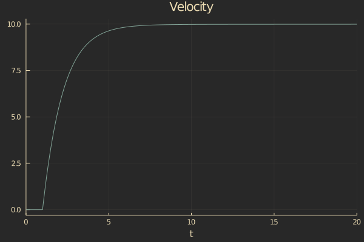
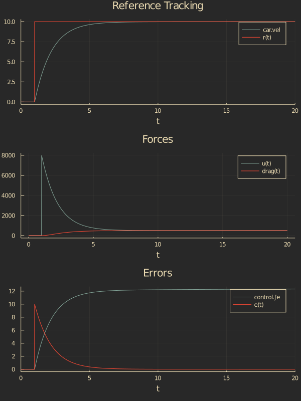

# Cruise Control

Let's see how we can use SimulationLogs for a typical controls simulation.

First, we'll start with a simple model of a car using ComponentArrays.jl,  DifferentialEquations.jl, and UnPack.jl.

```julia
using ComponentArrays
using DifferentialEquations
using UnPack

# Simple car with velocity-square drag
function car!(D, x, p, t; u=0.0)
    @unpack pos, vel = x
    @unpack CdA, m = p

    drag = CdA*vel^2
    D.pos = vel
    D.vel = (-drag*sign(vel) + u)/m
end

car_params = (
    m = 1000,
    CdA = 5,
)

car_ic = ComponentArray(
    pos = 0.0,
    vel = 0.0,
)
```

Now this is a pretty boring simulation; the car is just going to sit there. Let's add a cruise control system to the car so it will track a velocity setpoint. We'll use a proportional-integral (PI) controller to follow a reference step input.

```julia
# Car with cruise control
function cruise_car!(D, vars, p, t)
    @unpack ref, kp, ki = p.control
    @unpack ∫e, car = vars

    r = ref(t)
    e = r - car.vel
    u = kp*e + ki*∫e
    
    car!(D.car, car, p.car, t; u)
    D.∫e = e
end

# Parameters
p = (
    car = car_params,
    control = (
        ref = t -> 10*(t>1),
        kp = 800,
        ki = 40,
    )
)

# Initial conditions
ic = ComponentArray(
    car = car_ic,
    ∫e = 0.0,
)

prob = ODEProblem(cruise_car!, ic, (0.0, 20.0), p)
sol = solve(prob)
```

Now we can bring in the Plots.jl library to look at our velocity.

```julia
using Plots

plot(sol, vars=2, title="Velocity", legend=false)
```


Great. There's our velocity. But what if we want to plot the velocity against the reference signal `r`? Or what if we want to plot the reference tracking error `e`, control signal `u`, or even the drag force `drag`?

### Enter SimulationLogs
```julia
using SimulationLogs
```

Using SimulationLogs, we can tag any variable we'd like to see with the `@log` macro. So adding that to our simulation functions would look like:

```julia
function car!(D, x, p, t; u=0.0)
    @unpack pos, vel = x
    @unpack CdA, m = p

    @log drag = CdA*vel^2
    D.pos = vel
    D.vel = (-drag*sign(vel) + u)/m
end

function cruise_car!(D, vars, p, t)
    @unpack ref, kp, ki = p.control
    @unpack ∫e, car = vars

    @log r = ref(t)
    @log e = r - car.vel
    @log u = kp*e + ki*∫e
    
    car!(D.car, car, p.car, t; u)
    D.∫e = e
end
```

Now we can re-run our simulation and use the `scope` function to plot the outputs.

```julia
sol = solve(prob)

p1 = plot(sol, vars=2, title="Reference Tracking")
scope!(sol, :r)

p2 = scope(sol, [:u, :drag], title="Forces")

p3 = plot(sol, vars=3, title="Errors")
scope!(sol, :e)

plot(p1, p2, p3, layout=(3,1), size=(600,600))
```



If we want to get our logged variables (not just plot them), we can use the `get_log` function.

```julia-repl
julia> logsout = get_log(sol)
SimulationLog with signals:
  drag :: Float64
  e :: Float64
  u :: Float64
  r :: Int64


julia> logsout.drag
33-element Vector{Float64}:
   0.0
   0.0
   0.0
   0.0
   ⋮
 498.74065942087725
 498.94149067684566
 499.10812257810085
 499.1675529889568
```